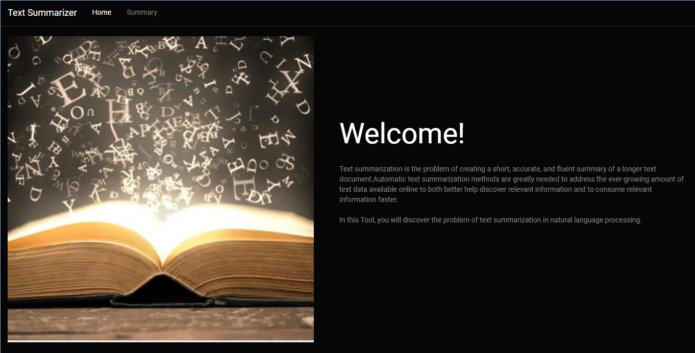
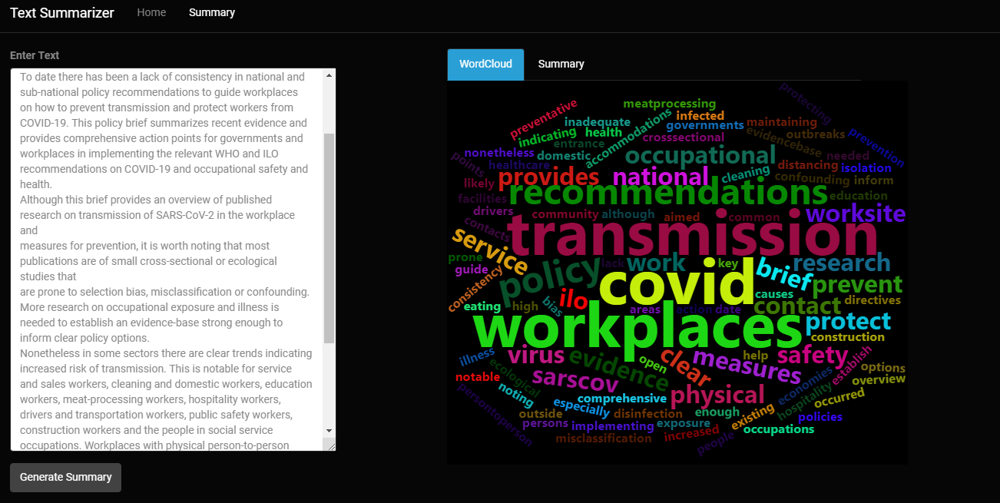
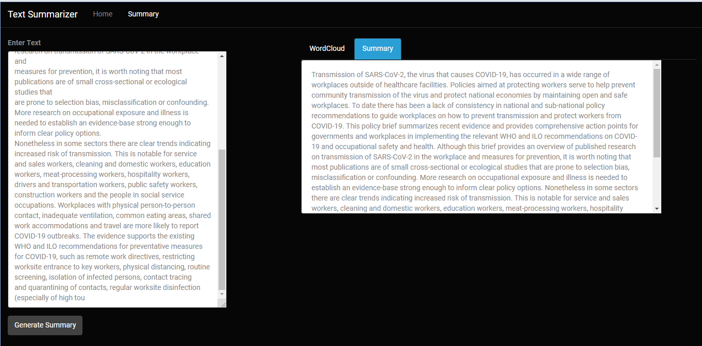

# TextSummarization-Shiny

A shiny tool, which summarizes the text given by a user. User interface is developed in R shiny and python codes are used at the backend for summarization process. Python codes are integrated with R shiny using an R package called reticulate.

# UI{.tabset}

## Home Tab

&nbsp;

&nbsp;

## Summary Tab - Wordcloud

&nbsp;
 

## Summary Tab - Summary

&nbsp;
 

